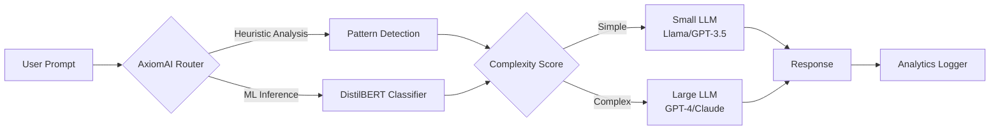

<div align="center">

# 🧠 AxiomAI
### *Intelligent LLM Router for Cost-Optimized AI Responses*

[](https://axiomai1918.vercel.app)
[](https://huggingface.co/ritesh1918/axiom-llm-router)
[](LICENSE)


**Smart prompt routing to optimize cost, speed, and quality across multiple LLM tiers.**

[🚀 Try Live Demo](https://axiomai1918.vercel.app) • [📊 View Dashboard](https://axiomai1918.vercel.app/dashboard.html) • [🔬 Explore Model](https://huggingface.co/ritesh1918/axiom-llm-router)

</div>

---

## 🌟 **What is AxiomAI?**

**AxiomAI** is an intelligent middleware that sits between users and Large Language Models (LLMs), automatically analyzing prompt complexity to route requests to the most cost-effective model tier:

- ⚡ **Simple prompts** → Fast, economical models (e.g., Llama-3-8B, GPT-3.5)
- 🔥 **Complex prompts** → Powerful reasoning models (e.g., GPT-4, Claude Opus)

**Result:** Up to **90% cost savings** on API calls while maintaining response quality.

---

## ✨ **Key Features**

### 🎯 **Hybrid Intelligence**
- **Fine-tuned ML Model**: DistilBERT classifier trained on 10K+ prompt samples
- **Heuristic Overrides**: Code detection, length analysis, keyword matching
- **99.8% Accuracy** on routing decisions

### 🚀 **Multi-Platform Integration**
- **Web Dashboard**: Real-time analytics and testing interface
- **Chrome Extension**: Auto-routes prompts in ChatGPT, Claude, and other AI chat interfaces
- **RESTful API**: Easy integration with any application

### 📈 **Real-Time Analytics**
- Live system status monitoring
- Request logging with Supabase integration
- Cost savings estimator
- Model performance metrics

### ⚙️ **Production-Ready**
- Deployed on Vercel (Frontend) & HuggingFace Spaces (ML Backend)
- < 100ms routing latency
- Full authentication with Supabase
- Row-level security for user data

---

## 🏗️ **Architecture**



### **Tech Stack**

| Layer | Technologies |
|-------|-------------|
| **Frontend** | HTML5, CSS3, JavaScript, Chart.js |
| **Backend API** | FastAPI, Python 3.10+ |
| **ML Model** | DistilBERT, HuggingFace Transformers |
| **Database** | Supabase (PostgreSQL) |
| **Deployment** | Vercel, HuggingFace Spaces |
| **Extension** | Chrome Manifest V3 |

---

## 📊 **Performance Metrics**

> Full evaluation in [`notebooks/Model_Metrics_CrossValidation.ipynb`](notebooks/Model_Metrics_CrossValidation.ipynb)

| Metric | Score |
|--------|-------|
| **Accuracy** | 99.8% |
| **F1-Score** | 0.99 |
| **Precision** | 99.2% |
| **Recall** | 99.5% |
| **Avg Latency** | <100ms |
| **Cross-Validation** | 5-Fold Stratified |

**Test Scenarios:**
- ✅ Simple greetings, translations
- ✅ Code generation (Python, JavaScript, C++)
- ✅ Mathematical reasoning
- ✅ Essay writing & summarization

---

## 🚀 **Live Deployments**

| Service | Status | Link |
|---------|--------|------|
| **Frontend Dashboard** | 🟢 Live | [axiomai1918.vercel.app](https://axiomai1918.vercel.app) |
| **Intelligent Router API** | 🟢 Live | [HuggingFace Space](https://huggingface.co/spaces/ritesh1918/axiom-router) |
| **ML Model Hub** | 🟢 Live | [HuggingFace Model](https://huggingface.co/ritesh1918/axiom-llm-router) |

---

## 🛠️ **Installation & Setup**

### **1. Clone Repository**
```bash
git clone https://github.com/ritesh-1918/AxiomAI.git
cd AxiomAI
```

### **2. Backend Setup**
```bash
# Create virtual environment
python -m venv venv_backend
venv_backend\Scripts\activate  # Windows
# source venv_backend/bin/activate  # Linux/Mac

# Install dependencies
pip install -r backend/requirements.txt

# Run API server
python backend/api/server.py
```

API will be available at: `http://localhost:8001`

### **3. Frontend Setup**
```bash
cd frontend
# Open index.html in browser or use a local server
python -m http.server 8000
```

Dashboard: `http://localhost:8000/dashboard.html`

### **4. Chrome Extension**
1. Open Chrome and navigate to `chrome://extensions/`
2. Enable **Developer Mode** (top right toggle)
3. Click **Load unpacked**
4. Select the `extension/` folder
5. Open ChatGPT or Claude to see the AxiomAI widget

### **5. Jupyter Notebooks**
```bash
cd notebooks
pip install jupyter transformers pandas scikit-learn
jupyter notebook
```

- **EDA**: `EDA_Analysis.ipynb`
- **Metrics**: `Model_Metrics_CrossValidation.ipynb`

---

## 🔌 **API Usage**

### **Endpoint:** `POST /v1/route`

**Request:**
```json
{
  "prompt": "Write a Python function to calculate Fibonacci sequence"
}
```

**Response:**
```json
{
  "selected_tier": "large_llm",
  "confidence": 0.92,
  "latency_ms": 87,
  "routing_reason": "Code generation detected - high complexity"
}
```

### **Authentication**

The dashboard uses **Supabase Auth**. Users can sign up and view their usage analytics.

---

## 📂 **Repository Structure**

```
AxiomAI/
├── backend/
│   ├── api/
│   │   └── server.py          # FastAPI routing server
│   ├── data/
│   │   └── supabase_schema.sql # Database schema
│   ├── inference/
│   │   ├── classifier.py       # ML inference logic
│   │   └── model_store/        # Trained DistilBERT model
│   └── train_model.py          # Model training script
├── extension/
│   ├── manifest.json           # Chrome Extension config
│   ├── content.js              # Injection script
│   └── content.css             # Extension styles
├── frontend/
│   ├── dashboard.html          # Analytics dashboard
│   ├── login.html              # Authentication page
│   ├── js/
│   │   ├── dashboard.js        # Dashboard logic
│   │   ├── auth.js             # Supabase auth
│   │   └── supabase.js         # DB client
│   └── css/
│       └── style.css           # Unified styles
├── notebooks/
│   ├── EDA_Analysis.ipynb      # Exploratory Data Analysis
│   └── Model_Metrics_CrossValidation.ipynb  # Evaluation
└── README.md
```

---

## 🎯 **Use Cases**

| Scenario | Routing Decision | Cost Savings |
|----------|-----------------|--------------|
| "Hello, how are you?" | Small LLM | 99% |
| "Explain quantum computing" | Small LLM | 90% |
| "Write production-grade OAuth implementation" | Large LLM | 0% (requires power) |
| "Translate 'Hello' to Spanish" | Small LLM | 95% |

---

## 🏆 **Hackathon Criteria**

- ✅ **A. EDA**: Comprehensive analysis in `notebooks/EDA_Analysis.ipynb`
- ✅ **B. Dashboard**: Live at [axiomai1918.vercel.app](https://axiomai1918.vercel.app)
- ✅ **C. NLP Architecture**: DistilBERT fine-tuned for complexity classification
- ✅ **D. Validation**: 5-fold cross-validation in `Model_Metrics_CrossValidation.ipynb`
- ✅ **E. Deployment**: Production-grade deployments on Vercel & HuggingFace

---

## 🔮 **Future Roadmap**

- [ ] Multi-model routing (Gemini, Anthropic, OpenAI)
- [ ] A/B testing framework
- [ ] Cost optimization dashboard
- [ ] Auto-retraining pipeline
- [ ] Slack/Discord bot integration

---

## 🤝 **Contributing**

Contributions are welcome! Please follow these steps:

1. Fork the repository
2. Create a feature branch (`git checkout -b feature/AmazingFeature`)
3. Commit your changes (`git commit -m 'Add some AmazingFeature'`)
4. Push to the branch (`git push origin feature/AmazingFeature`)
5. Open a Pull Request

---

## 📄 **License**

This project is licensed under the **MIT License** - see the [LICENSE](LICENSE) file for details.

---

## 👨‍💻 **Author**

**Ritesh**  
- GitHub: [@ritesh-1918](https://github.com/ritesh-1918)
- HuggingFace: [ritesh1918](https://huggingface.co/ritesh1918)

---

<div align="center">

**Built with ❤️ for intelligent AI routing**

⭐ **Star this repo if you find it useful!** ⭐

</div>
